# Procesverslag
**Auteur:** Martijn Reeuwijk

## Bronnenlijst
1. https://css-tricks.com/almanac/
2. https://developer.mozilla.org/nl/
3. https://developer.mozilla.org/nl/docs/Web/HTML/Element/dl
4. https://css-tricks.com/snippets/css/a-guide-to-flexbox/
5. https://css-tricks.com/almanac/properties/t/text-align/
6. https://www.funda.nl/koop/scherpenzeel-ge/huis-41055429-geerhoek-32/
7. https://www.funda.nl
8. https://www.w3schools.com/css/css_combinators.asp
9. https://stackoverflow.com/questions/24655902/group-dt-and-dd-in-span-under-dl

## Eindgesprek (week 7/8)

### Wat ging er lastig wat ging er goed?

zonder classes werken gaat oké, het houdt je HTML wel schoner maar in mijn geval gaat het ten koste van de CSS. Door deze methode zijn er niet veel herbruikbaren classes zoals bij een icoon.

Met de css selectors zonder classes ben ik er wel achter gekomen dat de > selector erg handig is en heb deze ook veel gebruikt.

Funda heeft veel SVGs deze heb ik in geladen als background en soms als SVG data in de HTML. door het in te laden als een SVG kun je hover erop zetten en de code dynamic aanpassen.

### Obstacles of anderen kansen.

Door het gebruik van een SVG  kan je de Fills aanpassen en zo met hover of JS

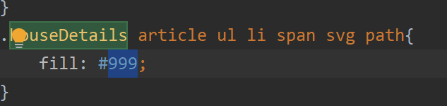

Dit een een NOT selector zo kan je op veel element op 1 na selecteren
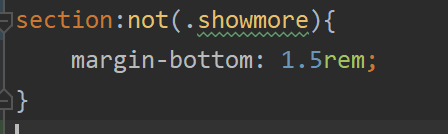

Class slector komt in een Array dus vergeet de [0] niet op het eind. Zo kan je er altijd nog door lopen als je meer elementen heb.
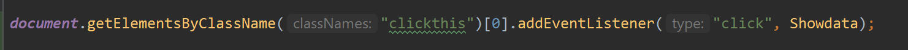

Het goed plaatsen van de :nth-of-type selector. Dit doe ik heel vaak op het verkeerde element
Dus dan select ik de 2de span in de div en die de tweede div and de span
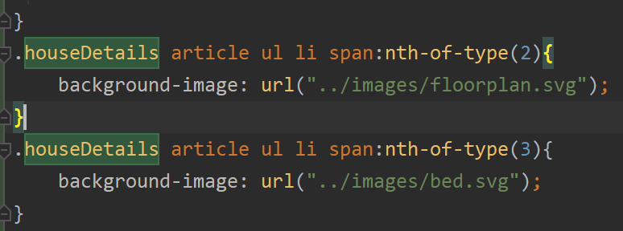
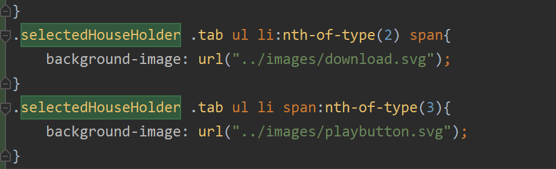

**Screenshot(s):**

-screenshot(s) van je eindresultaat-

## Voortgang 3 (week 6)

-same as voortgang 1-

Feedback
Headers
Heroimg mag een img tag
nav naar header ipv main
dt /dd /dl update naar DD

## Voortgang 2 (week 5)
Gaat goed eerste pagina is op basis af, moet nog Media Queries toevoegen samen met de Javascript
Pagina 2 is redelijk opweg naar een complete pagina. Wanneer dit is gedaan zal ik CSS en JS toevoegen aan al de paginas om het naar een hoger niveau tillen en het algehele product teverbeteren.
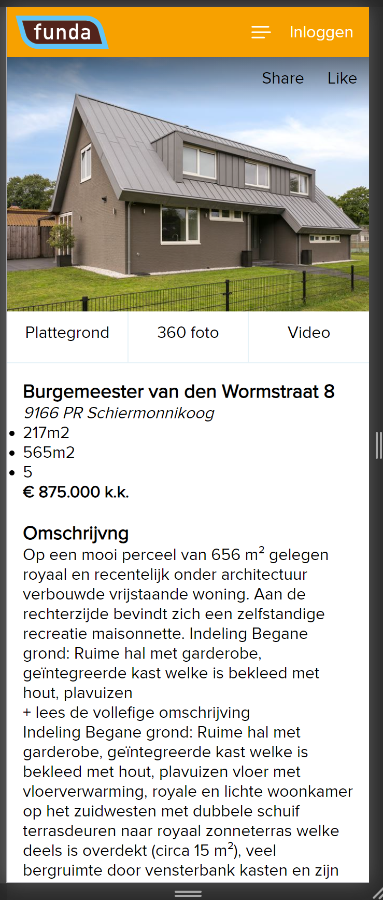

## Voortgang 1 (week 3)

### Stand van zaken

Alles is goed te doen, het enige lastige de de gestackete SVG en carusell.
Huren is ook een anderen pagina ipv kopen. Dit hadden ze ook kunnen oplossen met een Javascript functie of framework inlaat ipv een gehele nieuwe pagina.

**Screenshot(s):**

-screenshot(s) van hoe ver je bent met korte uitleg-
Alles gaat goed.
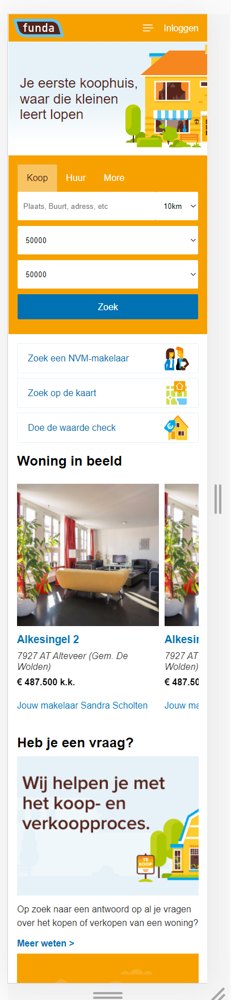
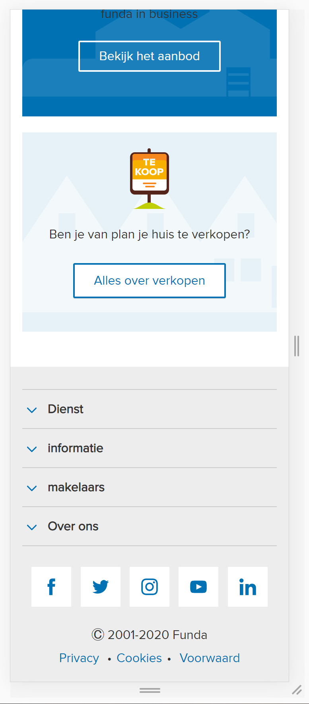
### Agenda voor meeting

-samen met je groepje opstellen-

| student 1      | student 2          | student 3    | student 4        |
| ---            | ---                | ---          | ---              |
| dit bespreken  | en dit             | en ik dit    | en dan ik dat    |
| an dat ook nog | dit als er tijd is | nog een punt | dit wil ik zeker |
| ...            | ...                | ...          | ...              |

### Verslag van meeting

-na afloop snel uitkomsten vastleggen-

## Breakdownschets (week 1)

-uitwerken voor de 1e werkgroep - eind van de eerste week-

## Intake (week 1)
-uitwerken voor de kick-off werkgroep - begin van de eerste week-

**Je startniveau:** Zwart

**Je focus:** surface laag met focus op mogelijke micro interacties of animaties.

**Je opdracht:** https://www.funda.nl/

Ik wil Funda namaken en aanpassen met een aantal micro interacties. Deze zullen de website een wat meer leven geven.

**Screenshot(s) van de eerste pagina (small screen):**

**Screenshot(s) van de tweede pagina (small screen):**
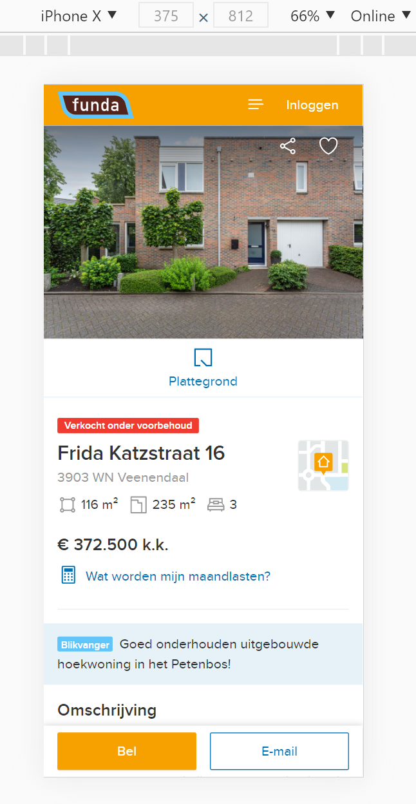

**Breakdown funda**
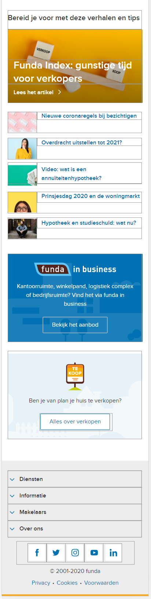
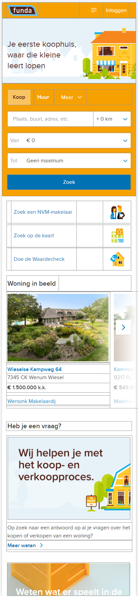
