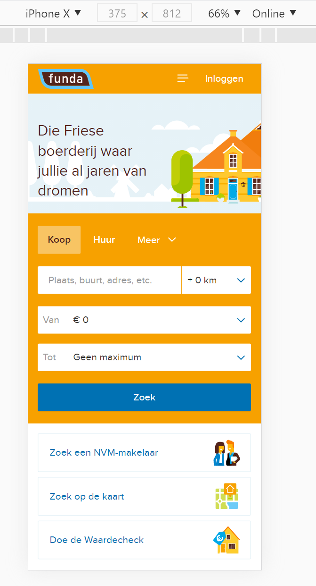

# Procesverslag
**Auteur:** Martijn Reeuwijk

Markdown cheat cheet: [Hulp bij het schrijven van Markdown](https://github.com/adam-p/markdown-here/wiki/Markdown-Cheatsheet). Nb. de standaardstructuur en de spartaanse opmaak zijn helemaal prima. Het gaat om de inhoud van je procesverslag. Besteedt de tijd voor pracht en praal aan je website.

## Bronnenlijst
1. -bron 1-
2. -bron 2-
3. -...-

## Eindgesprek (week 7/8)

-dit ging goed & dit was lastig-

**Screenshot(s):**

-screenshot(s) van je eindresultaat-

## Voortgang 3 (week 6)

-same as voortgang 1-

## Voortgang 2 (week 5)

-same as voortgang 1-

## Voortgang 1 (week 3)

### Stand van zaken

Alles gaat wel lekker, had aan het begin ook naar desktop moeten kijken dan had ik mijn HTML structuur anders gedaan ook ben ik nog niet aan de JS toe gekomen

**Screenshot(s):**

-screenshot(s) van hoe ver je bent met korte uitleg-
Eerste pagina is bijna af, heeft nog wat scaling nodig en de JS
Er is wel altijd een probleem met de super verfijnde styling
### Agenda voor meeting

-samen met je groepje opstellen-

| student 1      | student 2          | student 3    | student 4        |
| ---            | ---                | ---          | ---              |
| dit bespreken  | en dit             | en ik dit    | en dan ik dat    |
| an dat ook nog | dit als er tijd is | nog een punt | dit wil ik zeker |
| ...            | ...                | ...          | ...              |

### Verslag van meeting

-na afloop snel uitkomsten vastleggen-

## Breakdownschets (week 1)

-uitwerken voor de 1e werkgroep - eind van de eerste week-

## Intake (week 1)
-uitwerken voor de kick-off werkgroep - begin van de eerste week-

**Je startniveau:** Zwart

**Je focus:** surface laag met focus op mogelijke micro interacties of animaties.

**Je opdracht:** https://www.funda.nl/

Ik wil Funda namaken en aanpassen met een aantal micro interacties. Deze zullen de website een wat meer leven geven.

**Screenshot(s) van de eerste pagina (small screen):**

**Screenshot(s) van de tweede pagina (small screen):**

**Breakdown funda**

